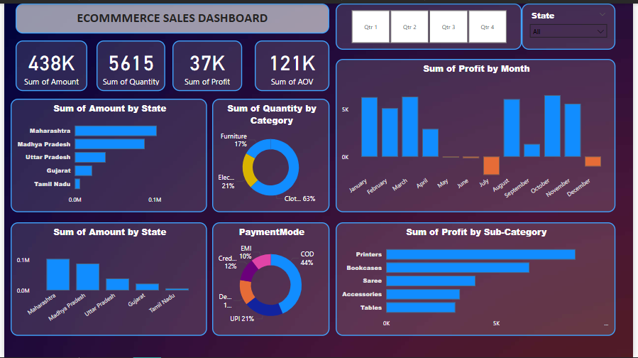

## 📊 E-commerce Sales Dashboard (Power BI)

### 📌 Overview
This Power BI project visualizes e-commerce sales data, providing insights into revenue, profit, quantity sold, and customer purchasing behavior. The dashboard enables better decision-making by analyzing sales performance across various dimensions.

### 🖼️ Dashboard Preview

### 🔍 Features
- **Key Metrics Display**: Total sales, quantity sold, profit, and average order value (AOV).
- **Sales Breakdown by State**: Visual representation of sales distribution across different regions.
- **Category Analysis**: Insights into sales quantity by product category.
- **Profit Trends**: Monthly profit trend visualization.
- **Payment Modes**: Distribution of transactions by payment method.
- **Top Sub-Categories**: Identifies top-performing sub-categories by profit.
- **Quarterly & State-wise Filtering**: Interactive filters to refine the analysis.

### 📂 Project Files
- `Main project.pbix` - Power BI report file.
- `Orders.csv` - Dataset containing order details.
- `Details.csv` - Additional dataset for deeper insights.
- `Dashboard.png` - Snapshot of the Power BI dashboard.
- `dark-gradient.jpg` - Background used for the dashboard.

### 📌 How to Use
1. Download and open `Main project.pbix` in Power BI.
2. Ensure datasets (`Orders.csv` & `Details.csv`) are in the correct directory.
3. Explore the interactive dashboard by applying different filters and visualizing insights.

### 📈 Insights Gained
- Maharashtra and Madhya Pradesh are the top-selling states.
- Clothing dominates the sales quantity, contributing over 60% of transactions.
- Printers and bookcases are the most profitable sub-categories.
- Cash on Delivery (COD) is the most used payment method.

### 🚀 Future Enhancements
- Adding predictive analytics for future sales trends.
- Integrating customer segmentation analysis.
- Enhancing UI with additional visual elements.

### 🏷️ License
This project is open-source and free to use. Feel free to contribute or modify as needed.

---
**🔗 Connect with me on LinkedIn:** [Your LinkedIn Profile](#)

